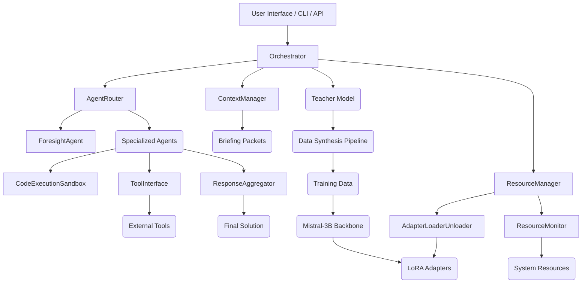

# Tanuki-Programmer Architecture Overview

This document provides a high-level overview of the Tanuki-Programmer's architecture, detailing its core components, their interactions, and the underlying design principles.

## 1. Core Principles

-   **Modularity:** Components are designed to be independent and interchangeable, allowing for flexible development and upgrades.
-   **Scalability:** Designed to handle increasing workloads, particularly for LLM inference and data processing.
-   **Extensibility:** Easy to add new agents, tools, and language support.
-   **Security:** Isolation of code execution and secure handling of sensitive data.
-   **Efficiency:** Optimized for resource utilization, especially VRAM and system RAM.

## 2. High-Level Component Diagram

## 3. Key Architectural Layers & Components

### 3.1. User Interaction Layer

-   **Web-based UI (`web_ui/`):** A simple web interface for direct user interaction and demonstration.
-   **Command-Line Interface (CLI) (`src/cli.py`):** Provides command-line access for scripting and automated tasks.
-   **API Endpoint (`src/api.py`):** A robust and scalable FastAPI endpoint for external integrations (e.g., OpenRouter, other applications). Handles authentication, authorization, and rate limiting.

### 3.2. Orchestration Layer (`src/orchestrator.py`)

-   **Orchestrator (Layer 3):** The central control unit responsible for managing the overall workflow of programming tasks. It receives requests from the user interaction layer, coordinates with various agents, and manages the execution flow.
-   **Agent Router:** Dynamically selects and routes tasks to the most appropriate specialized agent based on the `Foresight Agent`'s plan and the nature of the task.
-   **Foresight Agent:** (Conceptual/Integrated within Orchestrator) Responsible for initial task analysis, planning, and breaking down complex tasks into sub-tasks for specialized agents.

### 3.3. Agent & Tooling Layer

-   **Specialized Agents:** A collection of fine-tuned LLM agents (LoRA adapters on Mistral-3B backbone) each specialized in a particular programming domain (e.g., `tanuki-coder`, `tanuki-debugger`, `tanuki-reviewer`, `tanuki-architect`, etc.).
-   **Tool Interface (`src/tool_interface.py`):** A generic interface that allows specialized agents to interact with external tools (linters, formatters, debuggers, compilers, cloud APIs, etc.).
-   **Code Execution Sandbox (`src/sandbox.py`):** A secure, isolated Docker-based environment for executing code in various programming languages. Ensures safety and resource limits.

### 3.4. Context & Response Management

-   **Context Manager:** Assembles and compresses "briefing packets" for agents, including conversation history, relevant files, tool schemas, and few-shot examples. Optimizes context size for LLM efficiency.
-   **Response Aggregator (Layer 5):** Collects and formats solutions from expert agents, ensuring consistency and finalizes the output before presenting it to the user.

### 3.5. Resource & Model Management

-   **Resource Monitor (`src/resource_management.py`):** Tracks system resources (CPU, RAM, VRAM) to inform dynamic resource allocation.
-   **Adapter Loader/Unloader (`src/resource_management.py`):** Dynamically loads and unloads LoRA adapters based on demand, optimizing VRAM usage and loading times using an LRU cache.
-   **Mistral-3B Backbone:** The base LLM model (quantized GGUF) on which all specialized agents' LoRA adapters are applied.
-   **LoRA Adapters:** Small, efficient models that specialize the Mistral-3B backbone for specific programming tasks.

### 3.6. Data & Training Infrastructure

-   **Data Synthesis Pipeline (`src/data_synthesis.py`):** Generates vast, high-quality synthetic datasets for training specialized agents.
-   **Teacher Model (`src/teacher_model.py`):** A larger, more capable LLM (e.g., DeepSeek-Coder-33B-Instruct) used to generate high-quality reward examples for complex training data.
-   **Model Training (`src/model_training.py`):** Scripts and logic for fine-tuning the Mistral-3B backbone and training LoRA adapters.

## 4. Deployment Considerations (Google Cloud Platform)

-   **Docker (`src/Dockerfile`):** The entire system is containerized for consistent deployment across environments.
-   **Google Cloud Run:** Ideal for deploying the API endpoint and potentially other stateless services due to its serverless nature, autoscaling, and cost-effectiveness.
-   **Google Kubernetes Engine (GKE):** For more complex, stateful, or GPU-intensive workloads that require fine-grained control over infrastructure.
-   **Google Cloud Build (`deploy/gcp/cloudbuild.yaml`):** Automates the build and deployment process to GCP.
-   **Google Cloud Storage (GCS):** For storing models, datasets, and other large assets, accessible by deployed services.

This architectural overview provides a foundation for understanding the Tanuki-Programmer's design and how its various components work together to achieve its goal of autonomous programming.
